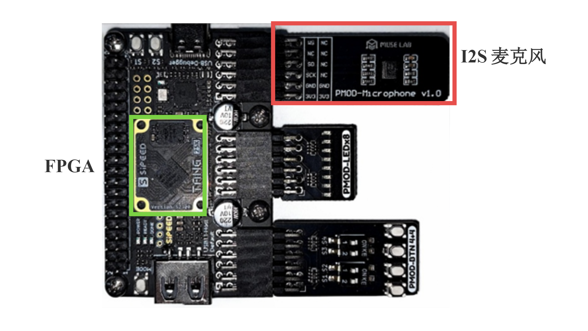
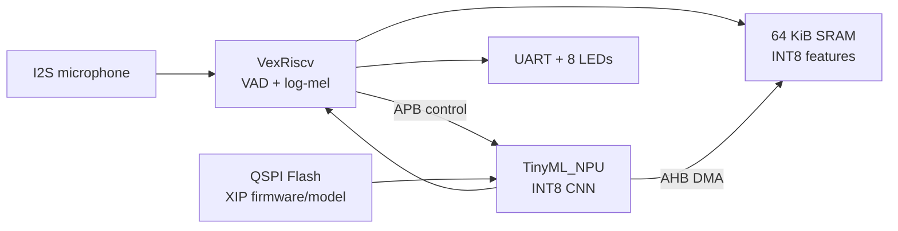

# TinyML_SOC

TinyML_SOC 是一个面向 **Sipeed Tang Primer 25K / GW5A-25A** 开发板的实时关键词识别 SoC 工程：

```text
VexRiscv SoC + TinyML_NPU + QSPI XIP firmware + I2S microphone + UART/LED demo
```

本仓库负责 SoC 集成、板级构建和实时 KWS demo。NPU、CPU 和 RTOS 分别通过 `third_party/TinyML_NPU`、`third_party/VexRiscv` 和 `third_party/FreeRTOS-Kernel` 引入。



图中为 Tang Primer 25K 与 I2S 麦克风连接示意。

## 系统路径



- CPU：VexRiscv RV32IM，指令 cache，带 JTAG debug。
- NPU：TinyML_NPU，通过 APB 配置，通过 AHB-Lite DMA 访问 SRAM/XIP。
- 音频：I2S 数字麦克风，CPU 执行 VAD 和定点 log-mel frontend。
- 存储：固件和模型位于外部 Flash `0x400000`，映射到 SoC XIP `0x00100000`。
- 目标板：Sipeed Tang Primer 25K，GW5A-25A，50 MHz，12 类关键词，UART 115200，8-bit LED 结果。

详细设计见 [SoC 架构](docs/architecture.md)，资源与时序见 [性能与资源](docs/performance.md)。

## 快速开始

```bash
make setup
make env
make soc-rtl
make gw5a-fw
```

生成 bitstream：

```bash
export GOWIN_IDE_BIN=/path/to/Gowin/IDE/bin
make gw5a-bitstream
```

烧录已连接的 Tang Primer 25K 板卡：

```bash
export GOWIN_PROGRAMMER=/path/to/Gowin/Programmer/bin/programmer_cli

make gw5a-probe
make gw5a-detect-flash
make gw5a-flash-bitstream
make gw5a-flash-kws
make gw5a-reboot
```

Programmer 脚本会自动选择下载器；只有多个下载器同时连接时才需要设置 `GOWIN_CABLE_INDEX` 和 `GOWIN_CHANNEL`。

打开串口：

```bash
export SERIAL_PORT=ftdi://ftdi:2232h/2
make monitor
```

自动重启、播放 `one two up down` 并要求至少一次有效识别：

```bash
export SERIAL_PORT=ftdi://ftdi:2232h/2
make gw5a-demo-check
```

## RTL 仿真

VCS 可用时运行两条完整回归：

```bash
make sim-vcs-testvector  # 固定输入，检查 NPU/GW5A golden
make sim-vcs-pcm         # 生成 one PCM，检查 I2S -> frontend -> NPU
```

`sim-vcs-pcm` 仅在仿真固件中使用加速 I2S 和 0/0 置信度门限；板级固件仍使用实际采样分频和默认 10/1 门限。无 VCS 许可证时可用 `make sim-testvector`、`make sim-pcm` 运行同一 testbench 的 Icarus 路径，但执行时间更长。

## 串口接口

启动：

```text
[TinyML_SOC] boot
[TinyML_SOC] fe_init_start
[TinyML_SOC] fe_init_ok
[TinyML_SOC] ready mic_sr=16276
```

一次识别：

```text
[KWS] vad_trigger avg_abs=... peak=...
[KWS] npu_start clip=...
[KWS] detect idx=0 label=one score=... margin=... cycles=... us=... clip=... avg_abs=... peak=...
```

`detect` 行是稳定接口。脚本严格解析 `idx`、`label`、`score`、`margin`、`cycles` 和 `us`。

## 目录

```text
hw/spinal/                   SoC SpinalHDL 和 VexRiscv AHB wrapper
sw/bsp/                      VexRiscv BSP 与外设驱动
sw/apps/kws_xip_rt/          FreeRTOS 实时 KWS 固件
fpga/gw5a/                   GW5A 顶层、约束和 filelist
scripts/                     构建、烧录、音频、串口和公开检查
docs/                        架构、性能、地址、上板、验证和排障
third_party/TinyML_NPU/      TinyML_NPU submodule
third_party/FreeRTOS-Kernel/ FreeRTOS-Kernel submodule
third_party/VexRiscv/        VexRiscv submodule
```

## 常用目标

```bash
make env                  # 检查本机工具
make setup                # 初始化 submodule
make soc-rtl              # 生成 build/rtl/VenusCoreRVTop.v
make gw5a-fw              # 构建 XIP 固件和 SRAM boot initmem
make gw5a-bitstream       # 运行 Gowin implementation
make gw5a-probe           # 读取 FPGA ID
make gw5a-detect-flash    # 读取 external Flash ID
make gw5a-flash-bitstream # 烧录 FPGA 配置到 Flash 0x000000
make gw5a-flash-kws       # 烧录 KWS 镜像到 Flash 0x400000
make gw5a-reboot          # 从 Flash 重配置 FPGA
make monitor              # 监听 115200 UART
make play-kws-test        # 播放固定英文关键词
make gw5a-demo-check      # 自动检查 ready 和 detect
make sim-vcs-testvector   # VCS NPU 固定向量回归
make sim-vcs-pcm          # VCS PCM 全数据路径回归
make check                # 自动化公开检查
```

## 文档

- [SoC 架构](docs/architecture.md)：CPU、NPU、AHB/APB、实时音频和启动流程。
- [地址映射](docs/memory-map.md)：SRAM、XIP 和 APB 寄存器窗口。
- [Flash 布局](docs/flash-layout.md)：镜像边界与 SRAM boot stub。
- [GW5A 上板](docs/gw5a-bringup.md)：构建、烧录、串口和音频验收。
- [性能与资源](docs/performance.md)：实现资源、时序和性能口径。
- [验证](docs/verification.md)：自动检查和板级实测记录。
- [故障排查](docs/troubleshooting.md)：下载、启动、串口和麦克风问题。
- [限制](docs/limitations.md)：v0.1 支持边界。

## 范围与许可

v0.1 只承诺 Sipeed Tang Primer 25K / GW5A-25A 实时 KWS 路径。仓库不提交训练数据、训练脚本、bitstream、ELF、bin、波形、综合实现目录或本地工具路径。

本项目自有源码使用 Apache-2.0。第三方组件保持各自许可证和归属，见 [THIRD_PARTY_NOTICES.md](THIRD_PARTY_NOTICES.md)。

## English Summary

TinyML_SOC is a real-time keyword-spotting SoC for the Sipeed Tang Primer 25K (GW5A-25A), integrating a VexRiscv CPU, TinyML_NPU, QSPI XIP firmware, an I2S microphone, UART logs, and LED results. Chinese documentation is authoritative; English summaries are supplemental.
