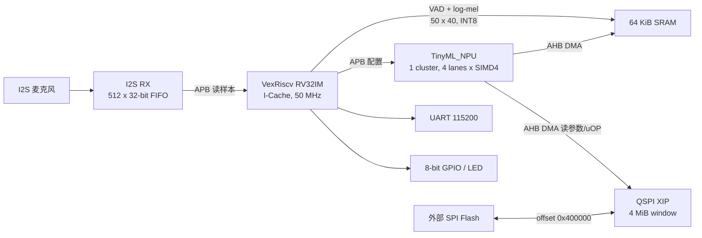
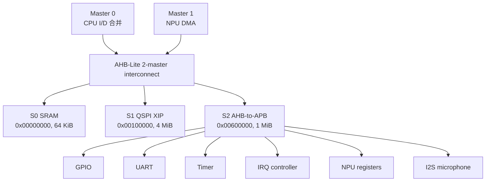
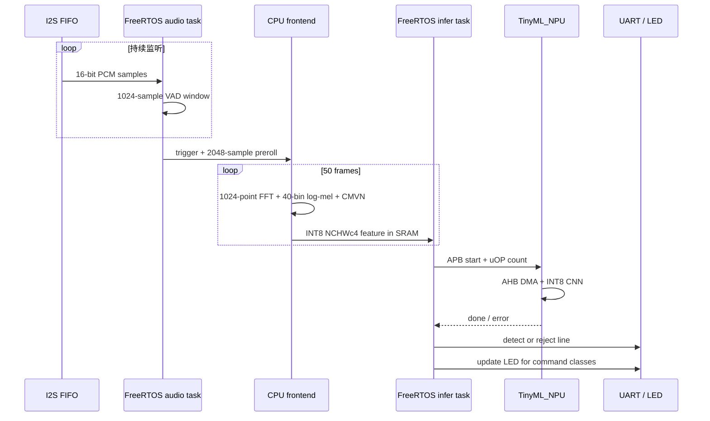
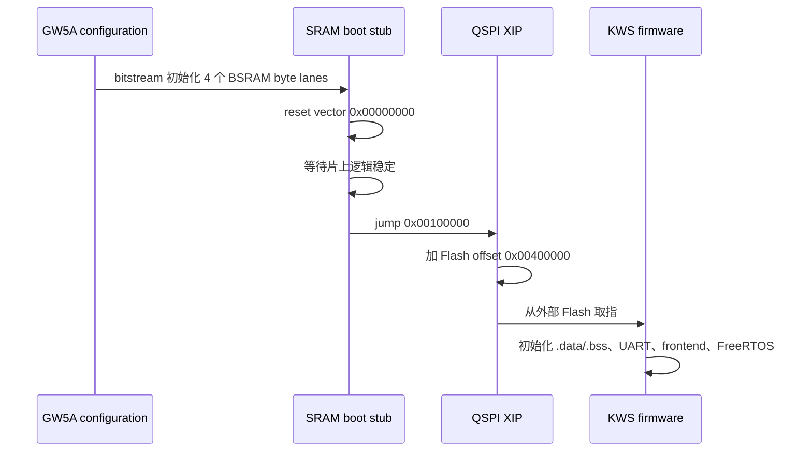

# SoC 架构 / Architecture

TinyML_SOC 在 Sipeed Tang Primer 25K 的 GW5A-25A FPGA 中集成 VexRiscv、TinyML_NPU、片上 SRAM、QSPI XIP 和实时音频外设。设计边界很明确：CPU 处理控制流、VAD 和定点 log-mel frontend；NPU 只执行 INT8 CNN；外部 Flash 保存可执行固件、模型参数和 uOP。

## 系统框图

## 总线与主从关系

- AHB-Lite 数据宽度为 32 bit，地址宽度为 32 bit。
- CPU 指令总线和数据总线在 wrapper 内合并为单个、单 outstanding 的 AHB master；数据访问固定优先。
- NPU 是第二个 AHB master，通过 DMA 读 uOP、参数和输入特征并回写输出。
- NPU 不能访问 APB 区域；`npuAllowApb=false` 在互联层阻止错误访问。
- NPU 的 APB 端口仅用于 CPU 配置、启动和状态读取。

## CPU 与 NPU 配置

| 模块 | 当前配置 |
|---|---|
| CPU ISA | RV32IM + Zicsr |
| CPU cache | 指令 cache 开启，数据 cache 关闭 |
| CPU reset vector | SRAM `0x00000000` |
| NPU 数据/累加 | INT8 / INT32 |
| NPU 并行度 | 1 cluster，4 lanes，每 lane SIMD4，共 16 个 INT8 乘法槽 |
| NPU 本地缓存 | IBUF 12 KiB，WBUF 2 KiB，OBUF 256 x 32 bit |
| 系统时钟 | 50 MHz |

`third_party/VexRiscv` 和 `third_party/TinyML_NPU` 保持独立 submodule。本仓库的 CPU 总线适配器位于 `hw/spinal/src/main/scala/cpu/VexRiscvAhb.scala`，SoC 集成顶层位于 `hw/spinal/src/main/scala/top/VenusCoreRVTop.scala`。

## 实时 KWS 数据流

音频路径的固定参数：

| 参数 | 值 |
|---|---:|
| 目标采样率 | 16 kHz |
| 50 MHz 下实际分频值 | 16276 Hz |
| 输入窗口 | 16000 samples，约 0.983 s（按实际采样率） |
| VAD 监听窗口 | 1024 samples |
| 触发前缓存 | 2048 samples |
| FFT | 1024 points |
| 帧移 | 320 samples |
| 特征 | 50 frames x 40 mel bins |
| NPU 输入 | 8000 bytes，INT8 NCHWc4 |
| 输出 | 12 个 INT8 logits |

## 软件任务

- `audio` task，优先级 3：轮询 I2S FIFO、运行 VAD、保留 preroll，并在采样到达时增量计算 frontend。
- `infer` task，优先级 2：接收完整特征，准备 uOP 地址，启动 NPU，读取 logits，输出结构化日志。
- NPU 推理期间 audio task 继续清空 FIFO，但丢弃这一段输入，推理完成后重新进入监听，避免把推理期残留样本拼进下一条命令。
- FreeRTOS 使用静态 task、queue 和 idle task 内存，不依赖动态堆分配。

## 启动路径

冷启动不直接把 reset vector 指向 XIP。SRAM boot stub 先运行，再跳转到 XIP，避免 QSPI 控制器尚未稳定时取到非法指令。

## 类别与 LED

| 类别 | GPIO 逻辑值 | 默认低电平点亮后的板上效果 |
|---|---:|---|
| `one` ... `eight` | `0x01` ... `0x80` | 对应单灯 |
| `up` | `0xFF` | 全亮 |
| `down` | `0x00` | 全灭 |
| `noise` / `silence` / reject | 不写 GPIO | 保持上次结果 |

固件默认 `KWS_LED_ACTIVE_LOW=1`，写 GPIO 前会反相；表中的“逻辑值”指反相前的类别编码。

## English Summary

The CPU performs VAD and fixed-point log-mel feature extraction, while TinyML_NPU executes the INT8 CNN. CPU and NPU share a two-master AHB-Lite fabric; firmware and model data execute in place from external QSPI Flash.
