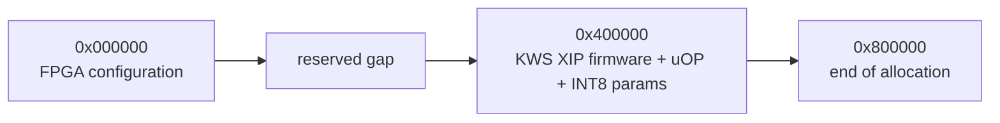

# Flash 布局 / Flash Layout



| 外部 Flash 区间 | 内容 | 生成文件 |
|---|---|---|
| `0x000000` 起 | GW5A FPGA 配置镜像 | `tinyml_soc_gw5a.fs` |
| `0x400000..0x7FFFFF` | KWS XIP 固件和模型，最大 4 MiB | `kws_xip_rt_flash.bin` |

## 地址转换

CPU 看到的 QSPI 窗口和物理 Flash offset 不相同：

```text
SoC 0x00100000 + n  ->  external Flash 0x400000 + n
```

`flash_offset_u32 = 0x00400000` 固化在生成 RTL 中。固件链接地址从 SoC `0x00100000` 开始，烧录工具则把二进制写入物理 offset `0x400000`。

## 启动原因

CPU reset vector 是 SRAM `0x00000000`。bitstream 把 32-byte boot stub 初始化进四个 BSRAM byte lane。复位后 stub 等待片上逻辑稳定，再跳到 SoC XIP `0x00100000`。

冷启动直接从 QSPI XIP 取第一条指令会让 CPU 与尚未稳定的 XIP 控制器同时启动，可能表现为无 UART 或 illegal instruction，因此本工程不使用这种方式。

## 自动检查

```bash
make soc-rtl
grep "assign flash_offset_u32 = 32'h00400000;" build/rtl/VenusCoreRVTop.v

make gw5a-fw
bash scripts/check_fw_layout.sh
```

检查项包括 KWS image 小于 4 MiB、四个 SRAM initmem lane 存在、固件链接地址与 Flash offset 一致。

## English Summary

The FPGA image starts at external Flash `0x000000`. The KWS XIP image starts at `0x400000` and appears to the CPU at SoC address `0x00100000`.
